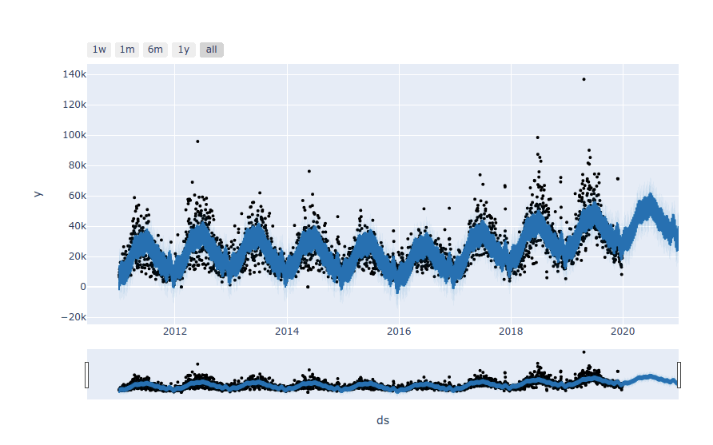

# Forecasting_Net_Prophet

Project Management:

Visual depictions of seasonality (as measured by Google Search traffic) that are of interest to the company.

An evaluation of how the company stock price correlates to its Google Search traffic.

A Prophet forecast model that can predict hourly user search traffic.

A plot of a forecast for the company’s future revenue.

Proficiency gained in the following areas:

Identifying patterns in time series data.

Mining for patterns in seasonality by using visualizations.

Building sales-forecast and user-interest predictive models.

 1: Found unusual patterns in hourly Google search traffic.

 2: Mined the search traffic data for seasonality.

 3: Related the search traffic to stock price patterns.

 4: Created a time series model by using Prophet.

 5: Forecasted the revenue by using time series models.

Sliced the data to just the month of May 2020. (During this month, MercadoLibre released its quarterly financial results.) Used hvPlot to visualize the results. 

Calculated the total search traffic for the month, and then compared the value to the monthly median across all months. 

Mined the Search Traffic Data for Seasonality

Marketing realizes that they can use the hourly search data, too. If they can track and predict interest in the company and its platform for any time of day, they can focus their marketing efforts around the times that have the most traffic. This will get a greater return on investment (ROI) from their marketing budget.
To that end, I mined the search traffic data for predictable seasonal patterns of interest in the company.

Grouped the hourly search data to plot the average traffic by the day of the week (for example, Monday vs. Friday).

Using hvPlot, visualized this traffic as a heatmap, referencing index.hour for the x-axis and index.dayofweek for the y-axis. 

Grouped the search data by the week of the year. 

Related the Search Traffic to Stock Price Patterns

During a meeting with people in the finance group at the company, I mentioned my work on the search traffic data. They wanted to know if any relationship between the search data and the company stock price exists, and if I can investigate further for opportunity.

To do so, I complete the following steps:

Read in and plot the stock price data. Concatenated the stock price data to the search data in a single DataFrame.

Noted that market events emerged during 2020 that many companies found difficult. But after the initial shock to global financial markets, new customers and revenue increased for e-commerce platforms. So, I sliced the data to just the first half of 2020 (2020-01 to 2020-06 in the DataFrame), and then used hvPlot to plot the data.

Created a new column in the DataFrame named “Lagged Search Trends” that offsets, or shifts, the search traffic by one hour. Created two additional columns:

“Stock Volatility”, which holds an exponentially weighted four-hour rolling average of the company’s stock volatility

“Hourly Stock Return”, which holds the percentage of change in the company stock price on an hourly basis

Reviewed the time series correlation, and then answered the following question: Does a predictable relationship exist between the lagged search traffic and the stock volatility or between the lagged search traffic and the stock price returns?

Created a Time Series Model by Using Prophet

Set up the Google search data for a Prophet forecasting model.

After estimating the model, plotted the forecast. 

Plotted the individual time series components of the model to answer the following questions:

- Displayed what time of day exhibits the greatest popularity.

- Exhibited which day of the week gets the most search traffic.

- Identified the lowest point for search traffic in the calendar year?
